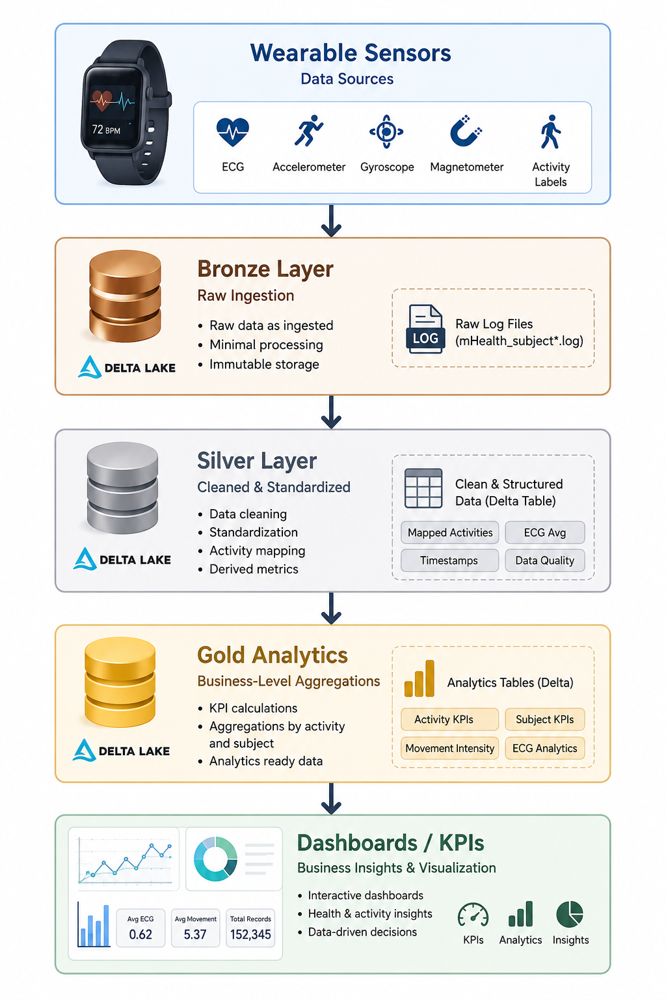
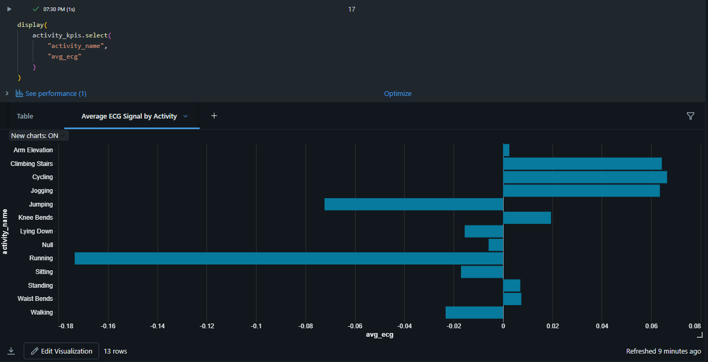
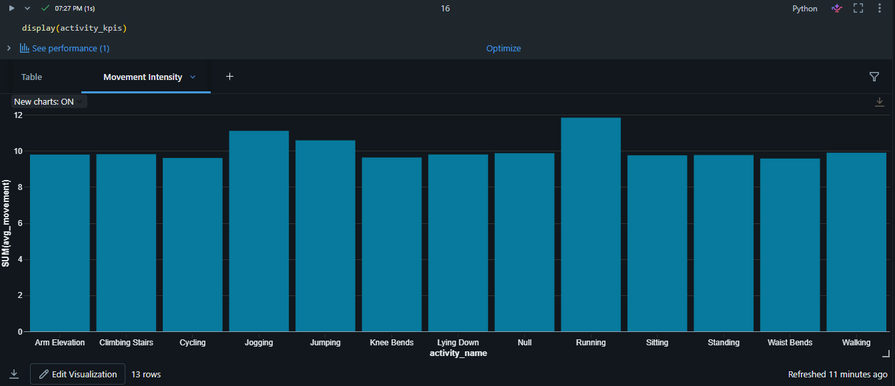
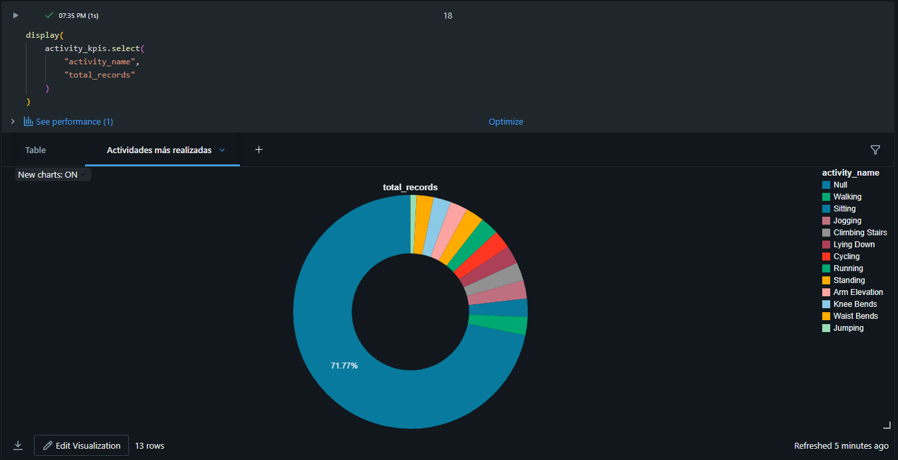

# 🏥 Healthcare Wearable Analytics Lakehouse


Modern healthcare analytics pipeline built with Databricks, PySpark, and Delta Lake using Medallion Architecture.

This project processes wearable sensor and ECG healthcare data to generate analytics-ready datasets, KPI dashboards, and health activity insights.

---

# 🚀 Project Overview

This project simulates a modern healthcare analytics platform capable of processing wearable IoT sensor data from multiple subjects performing physical activities.

The pipeline was developed using:
- Databricks
- PySpark
- Delta Lake
- Medallion Architecture

The objective was to transform raw healthcare sensor data into business-ready analytics and KPI dashboards.

---

# 🏗️ Architecture

```text
Wearable Sensors
       ↓
Bronze Layer
       ↓
Silver Layer
       ↓
Gold Analytics
       ↓
Dashboards / KPIs
```

---
## Architecture Diagram



---
# ⚙️ Technologies Used

| Technology | Purpose |
|---|---|
| Databricks | Data engineering platform |
| PySpark | Distributed data processing |
| Delta Lake | Lakehouse storage |
| Python | Data transformations |
| SQL Analytics | KPI generation |
| GitHub | Version control |

---
# 🧠 Dataset

Dataset used:
- mHealth Dataset (UCI Machine Learning Repository)

The dataset contains:
- Accelerometer data
- Gyroscope data
- Magnetometer data
- ECG signals
- Physical activity labels

Activities included:
- Walking
- Running
- Jogging
- Cycling
- Sitting
- Standing
- Jumping

---
# 🥉 Bronze Layer

The Bronze Layer stores raw healthcare sensor data.

## Features
- Multi-file ingestion
- Metadata tracking
- Source file lineage
- Ingestion timestamps
- Subject ID extraction

---
# 🥈 Silver Layer

The Silver Layer performs data cleaning and transformation.

## Transformations
- Null handling
- Activity label mapping
- Type casting
- ECG signal calculations
- Data standardization

---
# 🥇 Gold Layer

The Gold Layer generates analytics-ready datasets and KPI metrics.

## KPIs Created
- Average ECG signal
- Movement intensity
- Activity analytics
- Subject analytics
- Activity intensity classification

---
# 📸 Project Visualizations

## ECG Dashboard



---

## Movement Intensity Dashboard



---

## Most Performed Activities Dashboard



---
# 💡 Business Value

This project demonstrates how wearable healthcare data can be transformed into meaningful analytics for:
- Remote patient monitoring
- Fitness analytics
- Health-tech platforms
- Activity recognition systems
- Biometrics analytics

---
# 🧪 Future Improvements

Potential future enhancements:
- Real-time streaming ingestion
- Machine learning predictions
- Anomaly detection
- Advanced dashboards
- Cloud deployment

---
# 👨‍💻 Author

Kevin Sterling

Aspiring Data Engineer specialized in:
- Databricks
- PySpark
- Delta Lake
- Healthcare Analytics
- Modern Data Engineering

---
